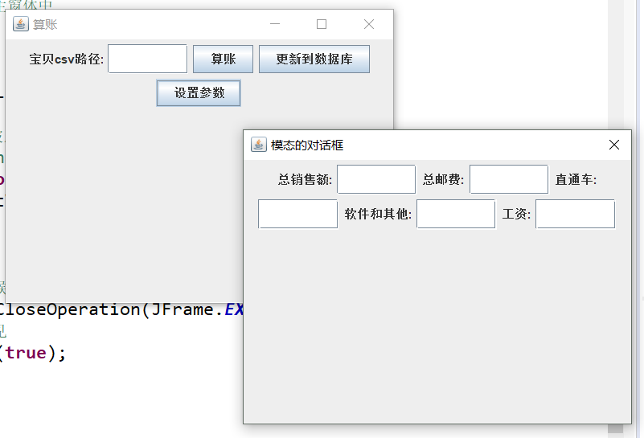

# taobaosuanzhang

一个用于帮助淘宝小卖家算账的小工具，导入从淘宝上下载的宝贝销售数据，就可以自动算账。

## 技术

java+jdbc+mysql+java swing

## 项目意义

- 实践使用jdbc
- 使用java swing的小例子
- 代码量小，很快就可以理解，适合新手学习

## 运行方法

### 创建数据库

在mysql5.7中创建eshop数据库，导入[eshop.sql](./eshop.sql)文件（utf-8编码）

## 运行

界面程序：

`src/gui/Gui.java`

## 运行效果

输入宝贝csv文件路径——>填入销售额等信息——>算账完成

